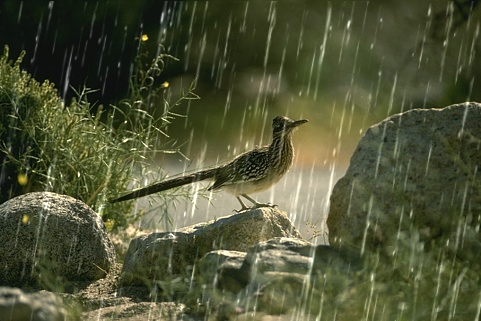
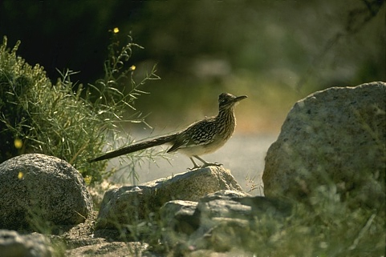
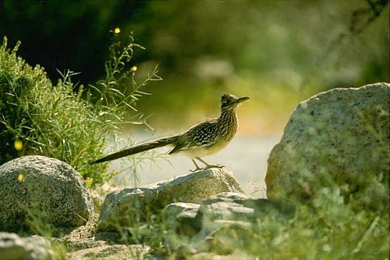
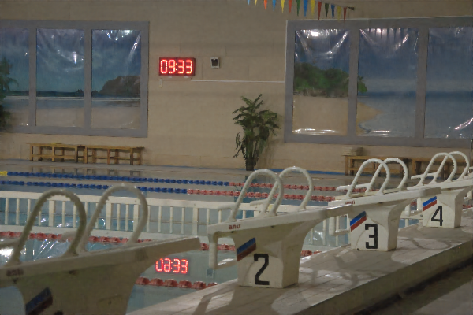
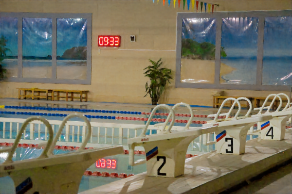
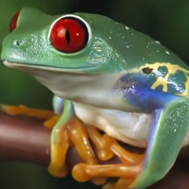

# Features_Preserving_Blurred_Image_Classification_Using_Large_Language_Model

 

[Sangram Lembe](https://sangramlembe.github.io/portfolio/), [Rutik Gawali](http://ruitkgawali.me)

### quickstart
InstructIR takes as input an image and a human-written instruction for how to improve that image. The neural model performs all-in-one image restoration. InstructIR achieves state-of-the-art results on several restoration tasks including image denoising, deraining, deblurring, dehazing, and (low-light) image enhancement.

 <b> Abstract</b> 

Image restoration is a fundamental problem that involves recovering a high-quality clean image from its degraded observation. All-In-One image restoration models can effectively restore images from various types and levels of degradation using degradation-specific information as prompts to guide the restoration model. In this work, we present the first approach that uses human-written instructions to guide the image restoration model. Given natural language prompts, our model can recover high-quality images from their degraded counterparts, considering multiple degradation types. Our method, InstructIR, achieves state-of-the-art results on several restoration tasks including image denoising, deraining, deblurring, dehazing, and (low-light) image enhancement. InstructIR improves +1dB over previous all-in-one restoration methods. Moreover, our dataset and results represent a novel benchmark for new research on text-guided image restoration and enhancement.

### Control and Interact

Sometimes the blur, rain, or film grain noise are pleasant effects and part of the **"aesthetics"**. Here we show a simple example on how to interact with InstructIR.

| Input       |(1) I love this photo, could you remove the raindrops? please keep the content intact | (2) Can you make it look stunning? like a professional photo     |
| ---        |    :----   |          :--- |
|       |        |    |
|   Input     |(1) my image is too dark, I cannot see anything, can you fix it? | (2) Great it looks nice! can you apply tone mapping?     |
|       |        |    |
|   Input     |(1) can you remove the tiny dots in the image? it is very unpleasant | (2) now please inprove the quality and resolution of the picture |
|       |        |    |

As you can see our model accepts diverse humman-written prompts, from ambiguous to precise instructions. *How does it work?* Imagine we have the following image as input:

Now we can use InstructIR. with the following prompt (1):
> I love this photo, could you remove the raindrops? please keep the content intact

Now, let's enhance the image a bit further (2).
> Can you make it look stunning? like a professional photo

